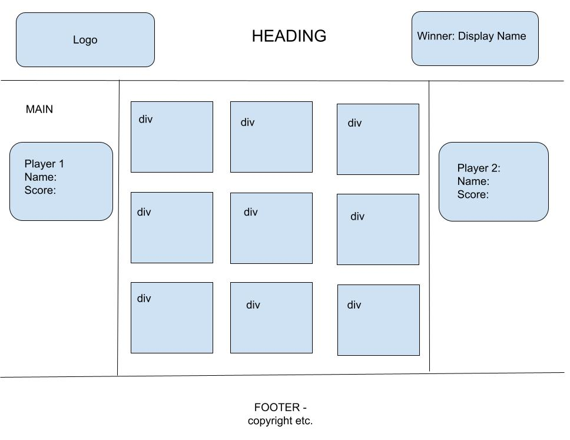

# tic-tac-toe-knee

## Tech Used

-   HTML
-   JavaScript
-   CSS Styling.

## Planning

1.  Create: Mock - Up:
    

2.  Build basic HTML and CSS to display the content to mirror 'mock-up' prior to functionality.

        - git commited as "basic skeleton"

     

3.  Tackle individual funcitonality problems and map out what needs solving:

-   create click event to change from blank to assigned player.

        -   git commited as "toggle"

-   Assign either X or O to player 1 and 2.

        -   git commited as "toggle"

-   Keep track of which tile has X or O.

        -   git commited as "toggle"

-   stop tile from being clicked twice.

        -   git commited as "toggle"

-   compare 3 in a row to compare for a win.

        - managed to compare 3 in a row, but a few bugs. Will have to rethink the logic.
        - git commit "three in a row":

        - git commit "three in a rowUpdate";

-   End game once winner is reached - managed to complete that the game wins. Now need to make sure only one player per tile: - git commit " three in a rowComplete";

-   Reset game.
    -the reset complete. Need to have delay on completeing it, so we can see the final tile color.

        -Also; need to figure out the diagonal top left to bottom right.

4. Look at Bonus material

-   Add player name and functional OK button. (complete)
-   Reset game after 9 clicks even if no winner. (complete)
-   Display Winner on top right of Screen. (complete)
-   Once a winner has been assigned. Alert to reset the game. ()
-   When name loaded make the button and input filed disapear.
-   Create multiple game score board - Keep track of wins... - Display a score of 1 per win and 0 for loss... Keep total tally.
-   Allow option to input time limit & or No. of Rounds.
-   Add web audio and API sounds
-   Add messaging board to display for all users.

## Unsolved Problems:

Most of the Dom manipulation was done through "trial and error".
Problems:

-   add a running score elluded me.
-   allow input for time or round/match number limitations also was a challenge
-   add sound... definetley didnt make it this far.

I realized half way though that many issues I had were due to the way I had constructed the page and would problably need to re-write to solve.

Still fairly happy considering this is my first ever Game.
